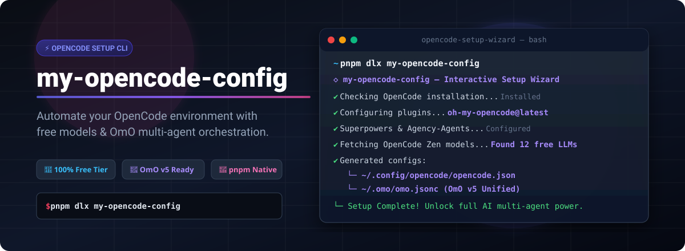

# my-opencode-config

<p align="center">
  
</p>

<p align="center">
  <a href="https://www.npmjs.com/package/my-opencode-config"></a>
  <a href="https://www.npmjs.com/package/my-opencode-config"></a>
  <a href="https://opensource.org/licenses/MIT"></a>
  <a href="https://nodejs.org"></a>
</p>

---

## 💡 Why It Exists

[OpenCode](https://github.com/anomalyco/opencode) is an ultra-powerful AI coding CLI, but setting it up with multi-agent harnesses like [Oh My OpenAgent (OmO)](https://github.com/code-yeongyu/oh-my-openagent) and routing its sub-agents to **free LLMs** usually requires complex manual configuration.

**`my-opencode-config`** is an interactive setup wizard that automates the entire process in under 60 seconds:
- Automatically detects and installs OpenCode if needed.
- Configures required plugins (`oh-my-opencode@latest`).
- Dynamically discovers free models from OpenCode Zen.
- Generates fully populated, modern configurations for both `opencode.json` and the new OmO v5 **`~/.omo/omo.jsonc`** unified configuration.

---

## 🚀 Quick Start

Run the setup wizard instantly with `pnpm dlx` (no installation required):

```bash
pnpm dlx my-opencode-config
```

Alternatively, install it globally for convenience:

```bash
pnpm add -g my-opencode-config
my-opencode-config
```

---

## ✨ Key Features

| Feature | Description |
| :--- | :--- |
| 🔮 **Dynamic Model Discovery** | Automatically scans OpenCode Zen for available free models (Gemini, Minimax, DeepSeek, Qwen) and ranks them by capabilities. |
| 🤖 **OmO v5 Unified Support** | Writes the new `~/.omo/omo.jsonc` configuration, assigning specialized sub-agents (`sisyphus`, `oracle`, `plan-consultant`, `librarian`) to free models. |
| 🛡️ **Harness Mirroring** | Mirrors agent & category rules into `[opencode]` blocks for complete multi-harness compatibility. |
| 🚀 **Superpowers & Agency-Agents** | Optional 1-click installer for `superpowers` skills and `agency-agents` specialized role suites. |
| 🔄 **Safe Backups** | Automatically backs up your previous configurations before making changes, stored in `~/.config/opencode/backups/`. |

---

## ⚙️ Config Files Managed

The wizard reads and generates two core configuration files:

```
~/.config/opencode/opencode.json  → Core OpenCode settings & model provider definitions
~/.omo/omo.jsonc                  → OmO v5 multi-agent orchestrator & sub-agent model map
```

### Generated `omo.jsonc` Example

```jsonc
{
  "$schema": "https://raw.githubusercontent.com/code-yeongyu/oh-my-openagent/dev/assets/omo.schema.json",
  "agents": {
    "sisyphus": { "model": "opencode/minimax-m2.5-free", "reasoning": "max" },
    "oracle": { "model": "google/gemini-2.5-flash", "reasoning": "high" },
    "plan-consultant": { "model": "opencode/minimax-m2.5-free", "reasoning": "max" },
    "librarian": { "model": "opencode/minimax-m2.5-free" }
  },
  "[opencode]": {
    "team_mode": { "enabled": true, "max_parallel_members": 4 }
  }
}
```

---

## 💳 Free vs. Paid Tier Support

This package is optimized to unlock **maximum value from free models** without spending on subscriptions or API keys.

If you eventually need access to higher usage limits or specialized frontier models, OpenCode offers budget-friendly subscription plans:
- **[OpenCode Go](https://opencode.ai/docs/go/)**: Affordable plan with expanded model options.
- **[OpenCode Zen](https://opencode.ai/docs/zen/)**: Premium plan for power users needing higher rate limits.

---

## 📚 References & Credit

This tool integrates and automates setup for these incredible open-source projects:

- **OpenCode**: [https://github.com/anomalyco/opencode](https://github.com/anomalyco/opencode)
- **Oh My OpenAgent (OmO)**: [https://github.com/code-yeongyu/oh-my-openagent](https://github.com/code-yeongyu/oh-my-openagent)
- **Superpowers**: [https://github.com/obra/superpowers](https://github.com/obra/superpowers)

---

## 📜 License & Release Notes

- **License**: MIT © [Yousuf Khan](https://github.com/youxufkhan)
- **Changelog**: See [CHANGELOG.md](CHANGELOG.md) for version history.


